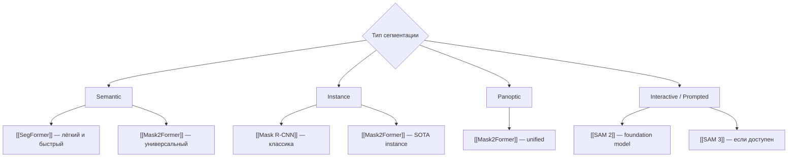

# MOC — Image Segmentation

> Навигационный хаб по задачам сегментации изображений.

---

## Дерево решений



---

## Модели

### Semantic Segmentation
- [[SegFormer]] — MiT backbone, лёгкий, хорош для edge
- [[Mask2Former]] — unified: semantic/instance/panoptic

### Instance Segmentation
- [[Mask R-CNN]] — классика, хорошо изучена
- [[Mask2Former]] — SOTA 2023+, Transformer-based

### Foundation / Interactive
- [[SAM 2]] — Meta, segment anything с видео-поддержкой
- [[EfficientSAM]] — дистилляция SAM для edge

---

## Бенчмарки
- [[ADE20K]] — semantic, 150 классов
- [[COCO Segmentation]] — instance + panoptic
- [[Cityscapes]] — urban driving scenes

---

## Ключевые концепты
- [[Semantic vs Instance vs Panoptic]] — различия типов
- [[Mask Decoder Architecture]] — как работают masked DETR
- [[Prompted Segmentation]] — SAM paradigm

---

## Dataview: Все модели сегментации

```dataview
TABLE benchmark_map AS "Score", sota_as_of AS "Verified"
FROM "05-Models"
WHERE contains(task, "segmentation")
SORT benchmark_map DESC
```
