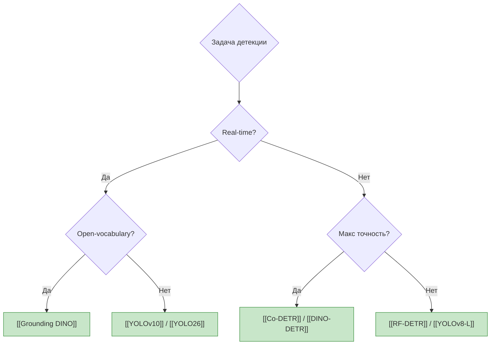

# MOC — Object Detection

> Навигационный хаб по задаче обнаружения объектов.

---

## Дерево решений



---

## Модели по категориям

### Real-time (Edge / Production)
- [[YOLOv10]] — SOTA real-time, NMS-free, anchor-free
- [[YOLO26]] — актуальный YOLO 2026
- [[RF-DETR]] — DETR-based, хорошее соотношение скорость/точность

### Высокая точность (Offline / Server)
- [[Co-DETR]] — collaborative training, top leaderboard
- [[DINO-DETR]] — self-supervised DETR

### Open-Vocabulary / Zero-Shot
- [[Grounding DINO]] — text-prompted detection, open-set
- [[OWLv2]] — zero-shot transfer от Google

### Foundation Models
- [[SAM 2]] — segment anything, can detect via prompts

---

## Бенчмарки
- [[COCO Detection]] — стандарт, 80 классов, mAP@50:95
- [[LVIS]] — long-tail distribution, 1200+ классов
- [[Objects365]] — масштабный pretraining датасет

---

## Ключевые концепты
- [[Anchor-Free Detection]] — без якорных боксов
- [[NMS (Non-Maximum Suppression)]] — постобработка
- [[FPN (Feature Pyramid Network)]] — мультимасштабные признаки
- [[DETR Architecture]] — detection transformer

---

## Топ статьи
- [[He2016-ResNet]] — backbone foundation
- [[DETR-2020]] — end-to-end detection с трансформерами

---

## Dataview: Все модели детекции

```dataview
TABLE benchmark_map AS "mAP", benchmark_fps AS "FPS", sota_as_of AS "Verified"
FROM "05-Models"
WHERE contains(task, "detection")
SORT benchmark_map DESC
```
